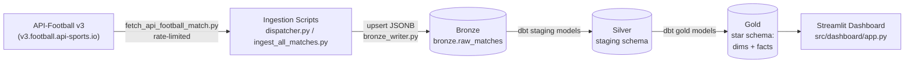
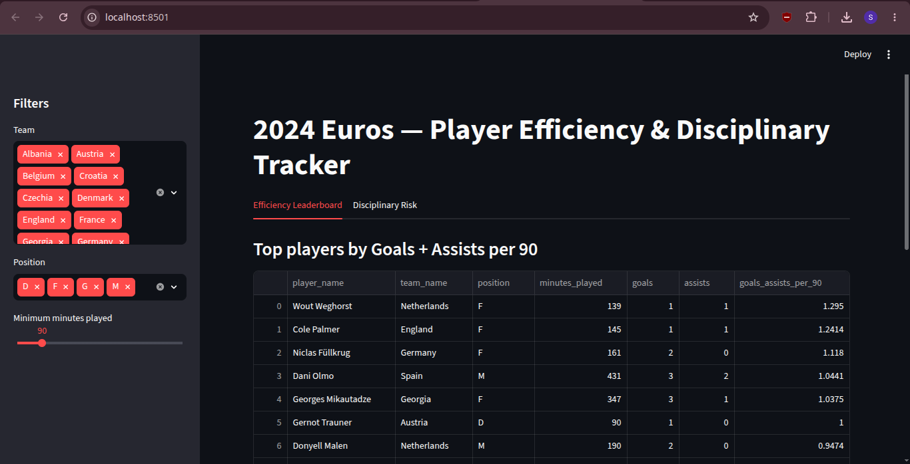

# Player Efficiency & Disciplinary Tracker — UEFA Euro 2024

A data engineering pipeline that ingests match data for **UEFA Euro 2024**, transforms it through a layered (Bronze → Silver → Gold) architecture with **dbt** and **PostgreSQL**, and surfaces the results in an interactive **Streamlit** dashboard for player efficiency and disciplinary risk analysis.

> The project originally targeted the 2026 FIFA World Cup, but switched to UEFA Euro 2024 since 2026 World Cup data isn't yet freely available via the API-Football API.

---

## Table of Contents

- [Project Description](#project-description)
- [Features](#features)
- [Tech Stack](#tech-stack)
- [Architecture](#architecture)
- [Project Structure](#project-structure)
- [Getting Started](#getting-started)
  - [Prerequisites](#prerequisites)
  - [Installation](#installation)
  - [Environment Variables](#environment-variables)
  - [Running the Pipeline](#running-the-pipeline)
  - [Running the Dashboard](#running-the-dashboard)
- [Data Source & Rate Limits](#data-source--rate-limits)

---

## Project Description

This project pulls raw match event and player statistics data for all 51 matches of UEFA Euro 2024 from the **API-Football** API, lands it untouched in a **Bronze** layer, cleans and models it through **Silver** and **Gold** layers with dbt, and visualizes player performance in a Streamlit dashboard.

The core analytical outputs are two precomputed, per-90-minute metrics for every player in every match:

- **Goals + Assists per 90** (`goals_assists_per_90`) — attacking efficiency
- **Disciplinary Risk per 90** (`disciplinary_risk_per_90`) — a weighted score combining yellow cards, red cards, and fouls committed

## Features

- 📥 **Automated ingestion** of all 51 Euro 2024 matches from API-Football, with rate limiting to respect the free-tier API limits
- 🥉 **Bronze layer** — raw JSON payloads persisted as-is to Postgres (`bronze.raw_matches`) with upsert-on-conflict, so re-ingesting a match never creates duplicates
- 🥈 **Silver layer** — dbt staging models that clean and type raw fields (e.g. coalescing API-returned `null`s to `0` for goals/assists/fouls, filtering out invalid event rows)
- 🥇 **Gold layer** — a star schema (`dim_matches`, `dim_players`, `dim_teams`, `fact_match_events`, `fact_player_match_stats`) with the efficiency and disciplinary-risk metrics precomputed
- 🔁 **Selective re-ingestion** — re-run ingestion for specific or previously failed matches without re-pulling everything
- 📊 **Streamlit dashboard** with separate *Efficiency Leaderboard* and *Disciplinary Risk* views, filterable by team, position, and minimum minutes played

## Tech Stack

| Layer | Tools |
|---|---|
| Language | Python 3.13 |
| Ingestion | `httpx` (async), Pydantic (data contracts/validation) |
| Database | PostgreSQL 17 |
| Transformation | dbt-core 1.12.5 (`dbt-postgres` adapter 1.11.0) |
| Dashboard | Streamlit |
| Containerization | Docker Engine, Docker Compose |
| Testing | pytest, dbt tests (`accepted_values`, `not_null`, etc.) |
| Data Source | [API-Football](https://www.api-football.com/) (v3) |

## Architecture

The pipeline follows a medallion (Bronze/Silver/Gold) architecture:



- **Bronze** — raw API-Football JSON stored as-is in a JSONB column, keyed by `match_id` (upsert, not append), for full traceability back to the source payload.
- **Silver** — dbt staging models normalize and clean the raw data (null-handling, event-type corrections).
- **Gold** — dbt models materialized as tables, structured as a star schema with the two efficiency/risk metrics precomputed so the dashboard never has to compute them at query time.
- **Dashboard** — Streamlit connects directly to the Gold schema in Postgres and queries it live.

## Project Structure

```
player_efficiency_tracker/
├── data/
│   ├── processed/
│   ├── raw/
│   ├── reference/
│   │   ├── fixture_teams.csv
│   │   └── match_id_mapping.csv        # maps internal match_id -> API-Football fixture_id
│   └── schema/
│       └── 01_bronze.sql               # Bronze table DDL
├── sandbox/                            # offline sample match JSON (used for schema design/testing)
│   ├── match_1145509.json
│   └── match_1145510.json
├── src/
│   ├── config.py
│   ├── db.py
│   ├── dashboard/
│   │   └── app.py                      # Streamlit dashboard entrypoint
│   ├── ingestion/
│   │   ├── bronze_writer.py            # Bronze upsert logic
│   │   ├── dispatcher.py               # Ingest specific/failed match_ids
│   │   ├── fetch_api_football_match.py
│   │   ├── id_mapping.py               # match_id <-> fixture_id resolution
│   │   ├── rate_limiter.py             # enforces API-Football rate limits
│   │   └── transformers/               # API-Football payload -> Pydantic models
│   ├── models/
│   │   ├── event_type.py
│   │   ├── match.py                    # Pydantic data contracts (Match, PlayerMatchStats, MatchEvent)
│   │   └── staging/
│   ├── scripts/
│   │   ├── generate_fixtureID_home_away.py
│   │   ├── generate_match_mapping.py
│   │   └── ingest_all_matches.py       # ingest all 51 Euro 2024 matches
│   ├── transformation/
│   └── utils/
├── tests/
├── transform/
│   └── player_efficiency_tracker/      # dbt project
│       ├── dbt_project.yml
│       ├── models/
│       │   ├── staging/                # Silver layer models
│       │   └── gold/
│       │       ├── dimensions/         # dim_matches, dim_players, dim_teams
│       │       └── facts/              # fact_match_events, fact_player_match_stats
│       ├── macros/
│       ├── seeds/
│       ├── snapshots/
│       └── tests/
├── docker-compose.yml                  # Postgres 17 service (host port 5433)
├── Dockerfile                          # ingestion/pipeline image
├── Dockerfile.dashboard                # dashboard image
└── requirements.txt
```

## Getting Started

### Prerequisites

- **Python 3.13**
- **Docker Engine** and **Docker Compose** (developed against Docker 29.7.2 / Compose v5.1.4, but any reasonably recent version should work)
- **dbt-core 1.12.5** with the `dbt-postgres` adapter (installed via `requirements.txt`)
- A free **API-Football** account and API key — [api-football.com](https://www.api-football.com/) (see [Data Source & Rate Limits](#data-source--rate-limits))

### Installation

```bash
git clone <repo-url>
cd player_efficiency_tracker

python -m venv myenv
source myenv/bin/activate      # on Windows: myenv\Scripts\activate

pip install -r requirements.txt
```

### Environment Variables

Create a `.env` file in the project root:

```env
API_KEY=your_api_football_key
API_BASE_URL=https://v3.football.api-sports.io
DATA_SOURCE=offline            # or "live" to call the API-Football API directly

DB_HOST=localhost
DB_PORT=5433
DB_NAME=euro24_db
DB_USER=postgres
DB_PASSWORD=postgres
```

> ⚠️ Don't commit your real `API_KEY`. If `api_key.txt` exists at the project root, make sure it's gitignored too — `.env` is the source of truth.

### Running the Pipeline

1. **Start Postgres:**

   ```bash
   docker compose up -d
   ```

   This brings up PostgreSQL 17, published on host port `5433` (mapped from the container's `5432`). The `bronze.raw_matches` table is created automatically (`CREATE TABLE IF NOT EXISTS`) the first time ingestion runs.

   **Useful Docker commands:**

   | Command | What it does |
   |---|---|
   | `docker compose up -d postgres` | Starts *only* the `postgres` service in detached mode — use this instead of a bare `docker compose up -d` if you don't also want to bring up other services defined in `docker-compose.yml` (e.g. the dashboard container). |
   | `docker exec -it <container_name> psql -U <db_user> -d <db_name>` | Opens an interactive `psql` shell inside the running Postgres container — handy for querying the database directly without installing `psql` locally. Find `<container_name>` with `docker compose ps` (by default it'll be something like `player_efficiency_tracker-postgres-1`). Example: `docker exec -it player_efficiency_tracker-postgres-1 psql -U postgres -d euro24_db` |

2. **Ingest match data:**

   ```bash
   python -m src.scripts.ingest_all_matches   # ingest all 51 matches
   python -m src.ingestion.dispatcher          # re-run/ingest specific or previously failed match_ids
   ```

   > ⚠️ These are run from the IDE during development, so double-check the exact invocation — if you hit import errors running the file directly (`python src/scripts/ingest_all_matches.py`), use the `-m` module form above instead, run from the project root.

3. **Build the Silver and Gold dbt models:**

   ```bash
   cd transform/player_efficiency_tracker
   dbt build
   ```

   This runs both the Silver staging models and the Gold star-schema models, plus any dbt tests.

### Running the Dashboard

From the project root:

```bash
streamlit run src/dashboard/app.py
```



## Data Source & Rate Limits

All match data comes from [API-Football](https://www.api-football.com/) (`v3.football.api-sports.io`). The free tier used during development is limited to:

- **100 requests/day**
- **10 requests/minute**

`src/ingestion/rate_limiter.py` throttles requests to stay within these limits when ingesting all 51 matches.
